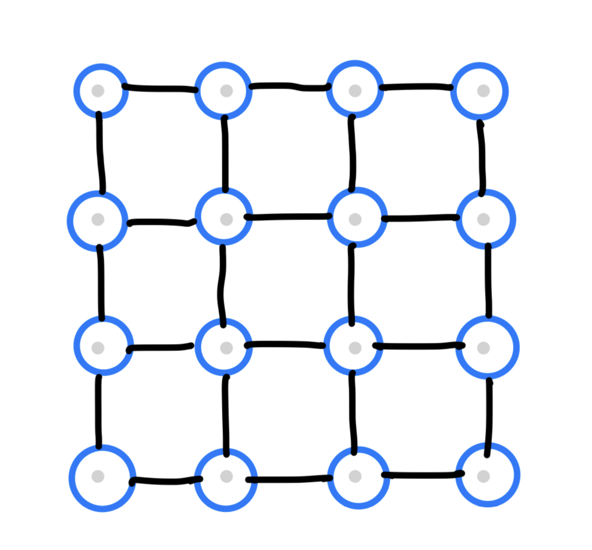
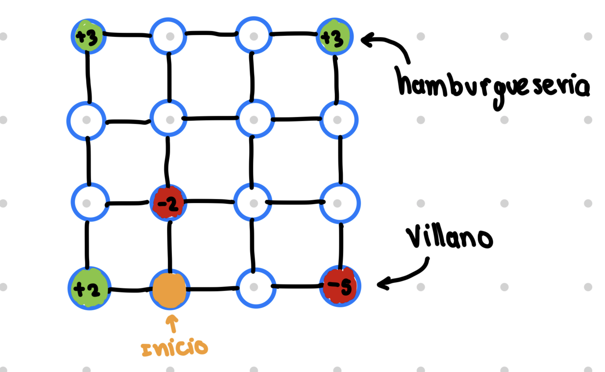
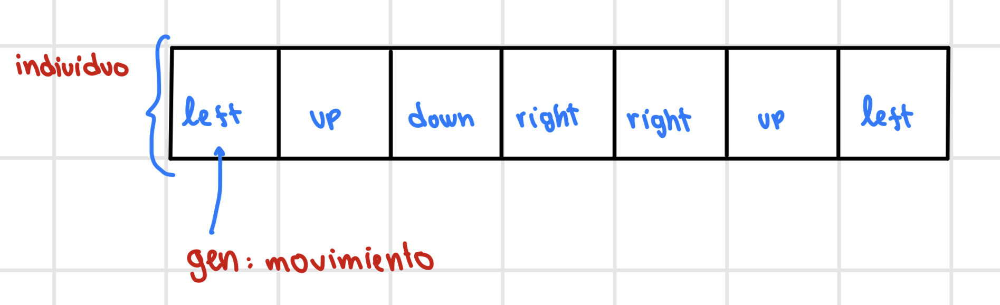

# Flash Day Game
created by: Juan David Salguero Medina
codigo: 201923136
Diseño y análisis de algoritmos
Bono parcial 3
## Parte 1: Contexto del juego
En este juego el jugador representa al super heroe Flash quien vive en la ciudad de Central City y todos los dias debe luchar contra criminales y asegurar que su ciudad este libre de peligro. 

Ya que flash se mueve y vive a una velocidad sobrehumana, su cuerpo consume una cantidad de calorias muy alta por lo que debe recargar su energia constantemente a través de la comida y le encanta ir a comer hamburguesas para lograr este objetivo. 
## Parte 2: Estructura del juego
El juego consiste en un grafo de V vertices organizados en forma de matriz cuadrada que representa la ciudad de Central City. En puntos aleatorios de la matriz habran puntos exclusivos y cada uno de estos puntos puede ser o un villano, o una hamburgueseria.




 Flash empezará la partida en un punto aleatorio de la ciudad con una cantidad aleatoria de energia y se debera mover ya sea para adelante, atrás , a la derecha o a la izquierda, cada movimiento que flash haga le agota 1 de su energia y no puede devolverse en sus pasos ya que va muy rapido para esto. Sabiendo esto, el objetivo de flash es pasar por la mayor cantidad de villanos y hamburgueserias sin quedarse sin energia. Una vez flash pasa por un lugar no puede volver a pasar por ahi. 

### Parte 2.1 consideraciones sobre el juego
1. Flash empieza con 5 de energia
2. cada vez que flash se mueve deja de color amarillo la celda en la que estuvo y pierde una unidad de energia
3. Si flash no tiene a donde moverse hay game over
4. Si flash no tiene más energia y no ha pasado por todas las hamburgueserias y villanos hay game over
5. Si flash logra pasar por todas las hamburgueserias y villanos gana.
6. Cada hamburgueseria le suma una cantidad aleatoria de energia entre 1 y 5 puntos y cada villano le resta una cantidad de energia aleatoria entre 1 y 8 

## Parte 3: Soluciones posibles
El jugador tiene la opción de jugar unicamente usando su mente e inteligencia pero tambien tiene la oportunidad de usar algortimos que aprendio durante su clase de DALGO en la universidad. En especial, el jugador puede usar algoritmos que permitan la navegación del grafo de forma que los movimientos que flash haga sean los mejores para salvar la ciudad

### Parte 3.1: Posibles aproximaciones y sugerencias del desarrollador
ya que podrian existir varias respustas a un mismo tablero se podria plantear un algortimo genetico que aleatoriamente generara movimientos y a medida que evoluciona sea capaz de dictar las mejores soluciones para que flash pueda tomar un camino optimo. 


#### Parte 3.1.1: Representación de un individuo y población
Para representar un individuo de solución se generaria un *array* de longitud $x$ donde $x$, $1 <= x <= tamTablero$ (esta longitud es debido a que en el peor caso flash podria hacer una cantidad $tamTableros$ de movimientos) donde cada gen de la solución representa un movimiento que flash haria en la ciudad siguiendo el orden de posiciones del array: $individuo[0]= mov_1, individuo[1]= mov_2, $ en general:  $individuo[i] = mov_{i+1}$


```python
# Función de creación de invidivuos
def generar_inidividuo(tamTablero):
    tamano = random.randint(1, tamTablero)
    lista = [random.choice(["left", "right", "up", "down"]) for _ in range(tamano)]
    return lista

# Función de creación de población inicial
def generar_poblacion(tamPoblacion, tamTablero):
    poblacion = [generar_individuo(tamTablero) for i in range(tamPoblacion)]
    return poblacion
```

#### Parte 3.1.2 Función de Fitness
Para una función de Fitness optima se podria hacer el recorrido que plantea un individuo y verificar por cuantas hamburgueserias y por cuantos villanos pasa teniendo en cuenta tres posibles escenarios para penalización: 

1. Que la energia de Flash se agote. 

2. Que llegue a un punto donde no pueda moverse por que ya paso por los vertices vecinos de donde se encuentra.

3. Que la cantidad de movimientos no sea suficiente en la solución/individuo (longitud) y aun tenga energia para moverse. 

Se premia al individuo cuyo valor de hamburgueserias y villanos sea mas cercano al proximo y se penaliza a los mas lejanos y más aun si llega a puntos muertos (2). 

#### Parte 3.1.3 Función de crossover
Para cruzar dos individuos se usará una función de cruce simple, donde los cromozomas de un hijo serán la mitad de un padre y la mitad de otro. 

#### Parte 3.1.4 Función de mutación
Despues de que se cree un decendiente este tendra una posibilidad aleatoria de mutar cualquiera de sus genes. 

#### Parte 3.1.5 Generaciones
Este proceso se repetira un total de N veces teniendo en cuenta que como el tablero se genera de forma aleatoria habran veces que no es posible alcanzar todos los puntos y otras veces si lo será, lo importante es que el algoritmo sea capaz de encontrar soluciones cercanas a lo esperado para que el jugador pueda pasar por la mayor cantidad de puntos de interés. 

